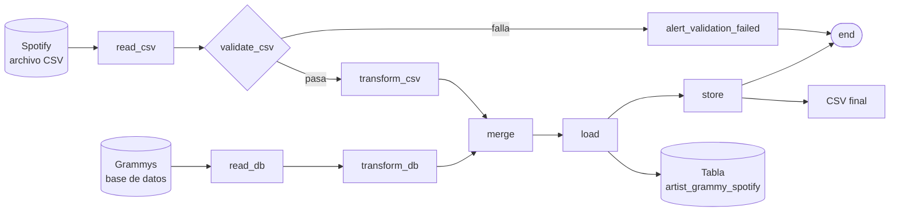
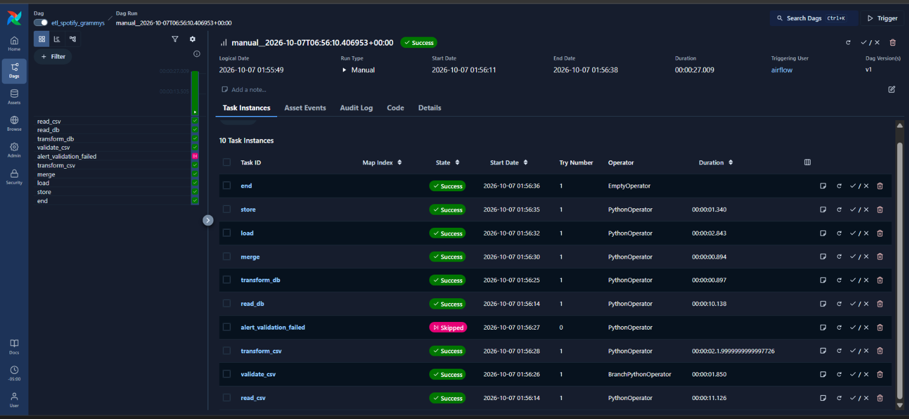
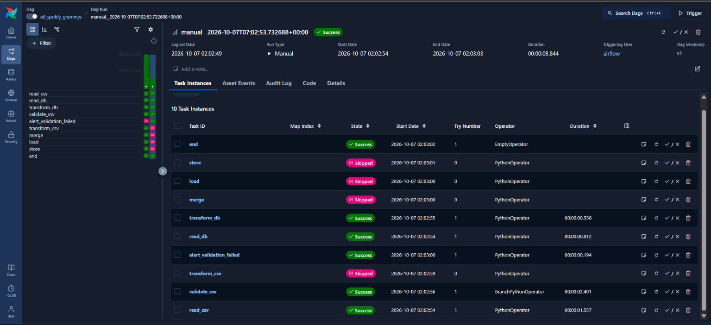
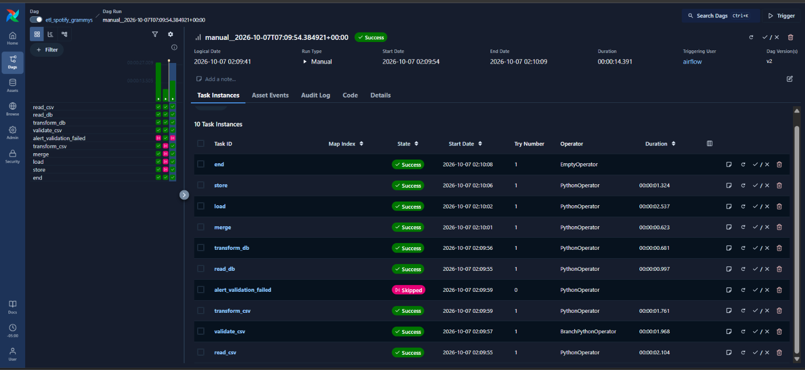
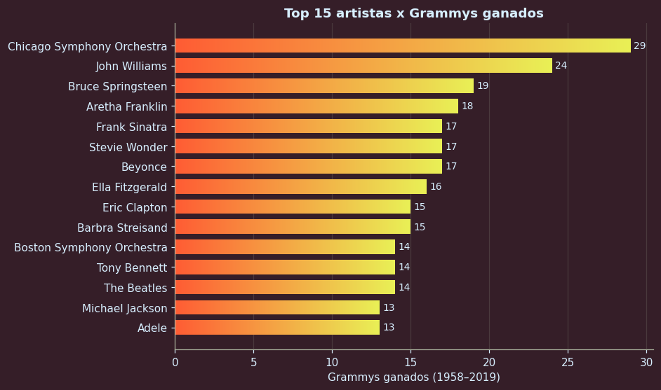
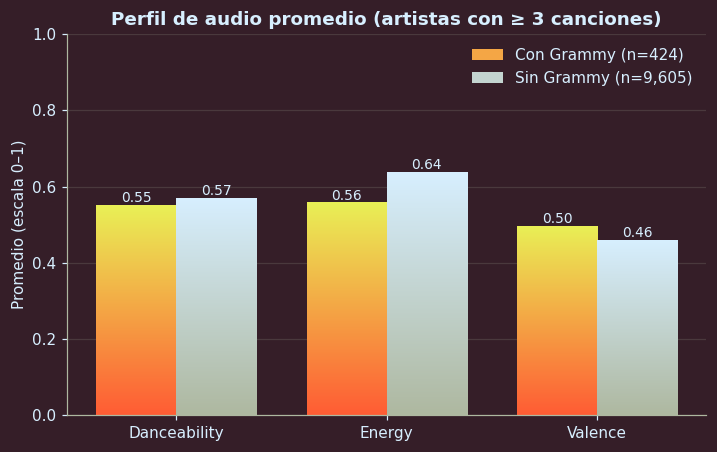
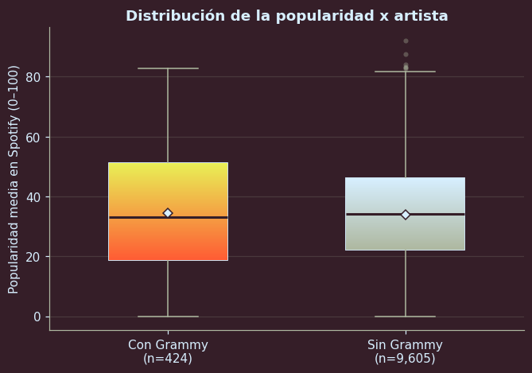
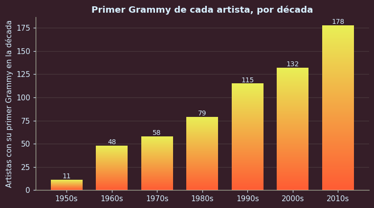
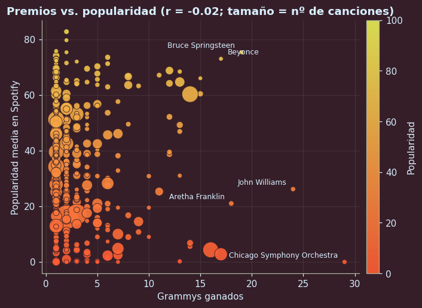

# Spotify y Grammys- relación entre ganar premios y cómo suenan esos artistas en Spotify

Este proyecto junta dos fuentes de datos para responder una pregunta: ¿los artistas que han ganado un Grammy suenan diferente, o son más populares en Spotify, que el resto?

Una fuente es un archivo con 114,000 canciones de Spotify. La otra es una base de datos con 4,810 premios Grammy entregados desde 1958. Un programa llamado Apache Airflow ejecuta todos los pasos en orden: lee las dos fuentes, revisa que los datos estén bien, los une por el nombre del artista y guarda el resultado en una base de datos y en un archivo CSV. Al final, un reporte con gráficos lee esa base de datos y muestra lo que se encontró.

El resultado es un archivo con 29,422 artistas, de los cuales 621 han ganado al menos un Grammy.

## Arquitectura del pipeline y flujo de datos (DAG)

Airflow trabaja con un mapa de tareas que se llama DAG. Dice qué se hace, en qué orden y qué tarea necesita que otra termine primero. El de este proyecto se llama `etl_spotify_grammys`.



Qué hace cada tarea:

1. `read_csv` lee el archivo de Spotify.
2. `validate_csv` revisa que los datos cumplan las reglas de calidad. Si pasan, el flujo sigue. Si no, se va por la alerta.
3. `transform_csv` convierte la lista de canciones en una lista de artistas, con el promedio de popularidad y de características del sonido.
4. `read_db` y `transform_db` hacen algo parecido con los premios: los leen de la base de datos y cuentan cuántos tiene cada artista. Corren al mismo tiempo que la parte de Spotify.
5. `merge` une las dos listas por el nombre del artista. Se conservan todos los artistas de Spotify y se marca cuáles tienen Grammy.
6. `load` guarda el resultado en la base de datos. Cada vez reemplaza la tabla, así que ejecutarlo dos veces no duplica nada.
7. `store` saca esa tabla a un archivo CSV.
8. `alert_validation_failed` solo se activa si la revisión falló. Muestra qué reglas no se cumplieron y en ese caso no se guarda nada.

Así se ve en Airflow. Primero una ejecución normal, donde todo sale en verde y la alerta se salta:



Después una con datos dañados a propósito. Se activa la alerta y las tareas de unir y guardar no corren:



Y una normal otra vez, para dejar todo como estaba:




## Estructura del repositorio

```
dags/                    el mapa de tareas de Airflow
extract/                 lectura de las dos fuentes
validate/                reglas de calidad y filas apartadas
transform/               limpieza y unión de los datos
load/                    guardado en la base de datos y en CSV
config/                  rutas y datos de conexión
scripts/                 carga inicial de premios y prueba de la validación
notebooks/               exploración de los datos y reporte
output/                  CSV final, reporte de validación y filas apartadas
data/raw/                aquí van los archivos descargados de Kaggle
data/processed/          archivos de paso entre tareas, se vuelven a crear solos
docs/img/                capturas de Airflow y gráficos del reporte
pipeline.py              corre todo el flujo sin Airflow, sirve para probar
docker-compose.yaml      enciende Airflow y las bases de datos
Dockerfile               prepara Airflow con las librerías del proyecto
requirements.txt         librerías que usa Airflow
requirements-local.txt   librerías para trabajar en tu computador
.env.example             plantilla de las variables de entorno
```

## Requisitos previos e instalación
Lo que hay que tener instalado:
- Docker Desktop, con al menos 4 GB de memoria asignada ps lo ideal son 8 GB.
- Python 3.12
- Git

Los datos se descargan de Kaggle, que pide una cuenta gratis:

- [Spotify Tracks Dataset](https://www.kaggle.com/datasets/maharshipandya/-spotify-tracks-dataset)
- [Grammy Awards](https://www.kaggle.com/datasets/unanimad/grammy-awards)

Guárdalos en la carpeta **data/raw** con estos nombres exactos:
- **spotify_tracks.csv**
- **the_grammy_awards.csv**

Después, para preparar Python pones los comandos en PowerShell de Windows

``` **powershell**
py -3.12 -m venv .venv
.venv\Scripts\Activate.ps1
pip install -r requirements-local.txt

## Configuración de variables de entorno y conexiones

Los datos de conexión y las claves están en un archivo llamado `.env`. Ese archivo no se sube a GitHub porque tiene datos privados. En su lugar se sube `.env.example`, que es la plantilla.

Para crear el tuyo:
**powershell**
Copy-Item .env.example .env
```

**Las variables que trae:**

| Variable | Para qué sirve |
|---|---|
| `AIRFLOW_UID` | Usuario con el que corre Airflow. Déjalo en 50000. En Linux o Mac se pone el resultado de `id -u` |
| `WAREHOUSE_USER` | Usuario de la base de datos de los datos |
| `WAREHOUSE_PASSWORD` | Contraseña de esa base de datos |
| `WAREHOUSE_DB` | Nombre de esa base de datos |
| `FERNET_KEY` | Clave que Airflow usa para proteger sus datos internos. Hay que generarla sino no funciona|

Para generar la clave y escribirla en el `.env`:

```powershell
$bytes = New-Object byte[] 32
[Security.Cryptography.RandomNumberGenerator]::Create().GetBytes($bytes)
$key = [Convert]::ToBase64String($bytes).Replace('+','-').Replace('/','_')
(Get-Content .env) -replace '^FERNET_KEY=.*', "FERNET_KEY=$key" | Set-Content .env
```

No hace falta crear conexiones a mano dentro de Airflow. El proyecto lee estos mismos datos del **.env**.

La base de datos de los datos se llama **warehouse** y se encuentra en distintas direcciones según desde dónde se mire:

- Desde tu computador: **localhost**, puerto **5433**.
- Desde dentro de Docker, que es como la ven las tareas de Airflow: **warehouse**, puerto **5432**.

Para entrar a Airflow, la dirección es **http://localhost:8080** con usuario **airflow** y contraseña **airflow**.

## Reglas de calidad y validación de datos en pandera

Pandera es una librería de Python que revisa una tabla contra reglas que uno define. Se aplica a los datos de Spotify apenas se leen, antes de hacer cualquier otra cosa. Las reglas están en **validate/spotify_schema.py**.

Lo que se revisa:
- Que no falten el identificador de la canción, los artistas, el álbum, el nombre ni el género.
- Que la popularidad esté entre 0 y 100.
- Que las medidas del sonido, como bailabilidad, energía y valence, estén entre 0 y 1.
- Que la duración y el tempo sean mayores que cero.
- Que cada dato tenga el tipo correcto, por ejemplo números donde van números.
- Que una misma canción no aparezca dos veces en el mismo género.

Qué pasa cuando algo no cumple:
- Las filas con problemas se apartan en **output/quarantine/spotify_invalid.csv**, con una columna que explica qué regla no cumplieron.
- El resto de las filas sigue su camino.
- Si las filas malas son más del 5%, o si falta una columna completa, se considera que la revisión falló. Entonces se activa la alerta y no se guarda nada en la base de datos.
- Un resumen de cada revisión queda en **output/validation_report.json**.

Con los datos reales, la revisión pasó. De las 114,000 canciones, 608 no cumplieron las reglas, el 0.53%:
- 450 eran canciones repetidas dentro del mismo género.
- 157 tenían el tempo en cero.
- 1 tenía varios datos vacíos y la duración en cero.

Para comprobar que la revisión distingue lo bueno de lo malo, hay un script que prueba tres casos: los datos reales, los datos con el 10% dañado y los datos sin una columna.

```powershell
python scripts\test_validation.py
```
Los dos últimos casos deben marcar que la revisión falla, y los datos reales que pasa.

## Reporte analítico y consultas SQL

El reporte está en **notebooks/02_reporte.ipynb**. Todo lo que muestra sale de consultas a la tabla **artist_grammy_spotify** de la base de datos, no del archivo CSV.

Estas son las consultas principales.

**Los artistas con más premios:**
```sql
SELECT artist_norm, grammy_wins, n_tracks, avg_popularity
FROM artist_grammy_spotify
ORDER BY grammy_wins DESC, n_tracks DESC
LIMIT 15;
```

**Comparación entre artistas con y sin Grammy, solo con los que tienen al menos tres canciones:**
```sql
SELECT has_grammy,
       COUNT(*)              AS artistas,
       AVG(avg_danceability) AS danceability,
       AVG(avg_energy)       AS energy,
       AVG(avg_valence)      AS valence,
       AVG(avg_popularity)   AS popularidad
FROM artist_grammy_spotify
WHERE n_tracks >= 3
GROUP BY has_grammy;
```

**Década del primer Grammy de cada artista:**
```sql
SELECT (first_win / 10) * 10 AS decada, COUNT(*) AS artistas
FROM artist_grammy_spotify
WHERE has_grammy
GROUP BY 1
ORDER BY 1;
```

**Para correr una consulta a mano:**
```powershell
docker compose exec warehouse psql -U warehouse -d warehouse -c "SELECT COUNT(*) FROM artist_grammy_spotify;"
```

Lo que se encontró:
- Solo 621 de los 29,422 artistas, un 2.1%, han ganado un Grammy.
- En popularidad casi no hay diferencia: 34.4 con Grammy y 34.0 sin él. Esto se comparó entre artistas con mínimo tres canciones, 424 con premio contra 9,605 sin premio.
- Los artistas con Grammy tienen algo menos de energía, 0.56 contra 0.64, y son un poco más alegres, 0.50 contra 0.46.
- Tener más premios no significa ser más popular hoy.












## Instrucciones de ejecución paso a paso

1. **Clona el repositorio y entra a la carpeta:**
   ```powershell
   git clone https://github.com/LauMarinAlvis/ws_etl_spotify_grammys_airflow.git
   cd ws_etl_spotify_grammys_airflow
   ```

2. Descarga los dos archivos de Kaggle y guárdalos en **data/raw **con los nombres que se indican arriba.

3. Crea el archivo **.env** y genera la clave, como se explica en la sección de variables de entorno.

4. Enciende Airflow y las bases de datos. La primera vez tarda unos minutos:
   ```powershell
   docker compose build
   docker compose up airflow-init
   docker compose up -d
   ```
   Con **docker compose ps** se comprueba que todo esté en **healthy**.

5. Prepara Python, como se explica en la sección de instalación.

6. Carga los premios Grammy en la base de datos. Debe terminar diciendo que cargó 4810 filas:
   ```powershell
   python scripts\load_grammys_to_db.py
   ```

7. Ejecuta el pipeline. Entra a **http://localhost:8080**, activa el interruptor del DAG **etl_spotify_grammys** y pulsa **Trigger**. Para ver la alerta, lanza otra ejecución con la opción **simulate_bad_data** activada, y después una normal. Si no quieres usar Airflow, también se puede correr todo con **python pipeline.py**.

8. Revisa el resultado. Deben existir **output/artist_grammy_spotify.csv** y la tabla en la base de datos, con 29,422 artistas y 621 con Grammy:
   ```powershell
   docker compose exec warehouse psql -U warehouse -d warehouse -c "SELECT COUNT(*), SUM(has_grammy::int) AS con_grammy FROM artist_grammy_spotify;"
   ```

9. Mira el reporte: abre **notebooks/02_reporte.ipynb** en VS Code y pulsa **Run All**.

10. Para apagar todo:
    ```powershell
    docker compose down
    ```
## Transformaciones realizadas

Cada fuente se transforma por separado antes de unirlas. En las dos, el resultado es una tabla con una fila por artista.

**De Spotify:**

- Se quitan las canciones repetidas. Una misma canción aparece una vez por cada genero al que pertenece, y contarla varias veces cambiaria los promedios.
- Cuando una canción tiene varios artistas, vienen juntos separados por punto y coma. Se separan para que cada artista tenga su propia fila.
- Los nombres se arreglan, todo en minuscula, sin tildes y sin espacios de mas. Así "Mel Tormé" y "Mel Torme" cuentan como el mismo artista.
- Se agrupa por artista y se calcula cuántas canciones tiene y el promedio de popularidad, bailabilidad, energía y valence.

**De Grammys:**

- El nombre del artista se arregla igual que en Spotify para que hagan macht.
- En casi el 38% de los premios la columna del artista viene vacia, pero el nombre aparece dentro de la columna **workers**, entre parentesis. Se saca de ahi para no perder esos premios.
- Se cuenta cuantos premios tiene cada artista y en que año gano el primero y el ultimo.

Se excluye **various artists**, porque no es un artista real sino una etiqueta que aparece en los datos de los dos lados.

De las **113,392** canciones que pasaron la validacion salieron **29,422** artistas, y de los **4,810 premios salieron **2,298** artistas.

### como funciona el merge- union

Las dos tablas se unen por el nombre del artista que ya se ha arreglado. Se parte de la tabla de Spotify y a cada artista se le pega lo que tenga en la de Grammys. eligi que a partir de Spotify, porque decidi responder sobre como suenan los artistas de Spotify.

El resultado es que quedan todos los artistas de Spotify. Los que ganaron algun premio llevan su total y el año del primero y del ultimo, y la columna **has_grammy** en verdadero. Los demás tienen cero premios y **has_grammy** en falso, asien total son 29,422 artistas y 621 tienen Grammy; cada fila guarda tambian el identificador de la ejecucion de Airflow y la hora para cuestiones de logs o segimientos y reportes y para saber de donde viene.

Quedaron **1,677** artistas de Grammys sin pareja en Spotify, por no estar allá o por estar escritos distinto. No se usan, porque no se puede saber como suenan; antes de guardar, se comprueba que no haya nombres repetidos y que el número de filas sea el mismo despues de unir, si algo no cuadra, se detiene en vez de guardar datos mal unidos.

### Decisiones de diseño

- Las filas con problemas se apartan y no frenan todo. Un solo registro dañado no debería impedir que se guarde lo demas. Pero si más del 5% de las filas esta mal, o falta una columna entera, se para todo, porque eso ya indica un problema en el archivo, las reglas y el límite están en **validate/spotify_schema.py**

- Se usa Airflow 3.3.2, que es la versión estable actual, cambia un poco la forma de escribir el DAG respecto a la versión 2, pero la idea es la misma:el DAG esta escrito en codigo Python en el archivo **dags/etl_spotify_grammys.py**, donde se definen las tareas y el orden en que se ejecutan.

- Hay dos bases de datos separadas, una la usa Airflow para guardar su propio historial y la otra la llamada **warehouse**, guarda los datos del taller; entonces asi no se mezclan y se definen en **docker-compose.yaml**

- El CSV final se guarda en la carpeta **output** del computador y no en Google Drive, uso esta manera local por que me evita manejar claves de acceso, el archivo que lo ejecuta es **load/csv_export.py**

- La tabla final se reemplaza en cada ejecución, por que asi correr el pipeline varias veces deja siempre el mismo resultado y no duplica datos, la info esta en **load/postgres.py**

- Las tareas se pasan los datos por archivos temporales en **data/processed**, porque son tablas grandes y no conviene pasarlas por los mensajes internos de Airflow, lo maneje en la siguiente ruta **dags/etl_spotify_grammys.py**

- Se removio la categoria llamada **Various Artists** de ambas fuentes de datos, por que no representan a una persona o agrupación real, conservarla aumentaria de manera falsa el conteo de canciones y la cantidad de victorias.

- El reporte se hizo con Python **notebooks/02_reporte.ipynb**

**Fuentes**

https://airflow.apache.org/docs/apache-airflow/stable/core-concepts/dags.html
https://airflow.apache.org/docs/apache-airflow/stable/core-concepts/dags.html#declaring-a-dag
https://airflow.apache.org/docs/apache-airflow/stable/core-concepts/dags.html#testing-a-dag